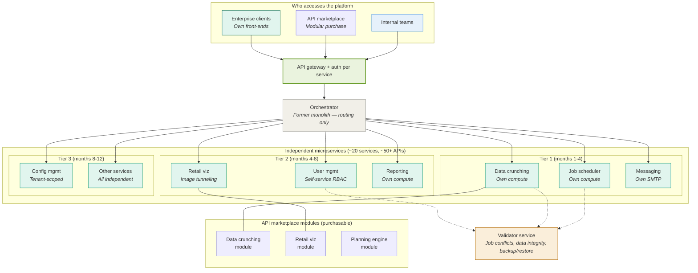

# After state: microservices + API marketplace

> Monolith reduced to orchestrator. ~20 services, ~50+ APIs, each independently scalable. Security layer per service. External marketplace access for modular purchase.

## What changed

| Dimension | Before | After |
|-----------|--------|-------|
| **Architecture** | Single monolith, all services in one codebase | ~20 independent microservices, ~50+ APIs. Monolith is just an orchestrator. |
| **Compute** | Shared. One heavy job starves everything. | Independent per service. Job scheduler scaling doesn't affect messaging. |
| **Failure isolation** | 2-3 days to find the responsible team | Each service independently monitored. Failures are scoped to one service. |
| **External access** | Full platform or nothing | API marketplace: buy individual modules (data crunching, retail viz, planning engine) |
| **Concurrent jobs** | Two parallel jobs in same tenant = data corruption and crashes | Validator service checks for conflicts. Progressive relaxation based on what data each job touches. |
| **User management** | Every access change = ticket to implementation team | Self-service RBAC. User Manager role with tenant-scoped access. |
| **Image processing** | Not possible (retailers wouldn't share images) | Tunneling service pulls, processes, displays, and discards. Never stores. |
| **Team** | 3 people (PM + architect + junior dev) | 18 people (3 PMs, 15 devs) |
| **Market access** | Enterprise-only, full platform deals | SMBs and modular buyers via marketplace. New market segment unlocked. |
| **Customer growth** | Constrained by reliability and packaging limitations | 700% growth in number of customers supported |

## Key architectural decisions

**Why the monolith became an orchestrator, not deleted:**
Rewriting everything from scratch would have taken 2+ years and introduced massive risk. Keeping the monolith as a thin routing layer meant we could isolate services incrementally, one at a time, with rollback capability at each step.

**Why auth per service, not a central auth gateway:**
Central auth creates a single point of failure and doesn't support the marketplace model (different clients need different service-level permissions). Per-service auth meant we could grant marketplace customers access to specific modules without exposing the full platform.

**Why the validator is a cross-cutting service, not embedded in each microservice:**
Job conflict detection requires a global view of what's running across the tenant. Embedding validation logic in each service would have created consistency problems (each service making its own concurrency decisions without knowing what other services are doing). A dedicated validator service has the full picture.
