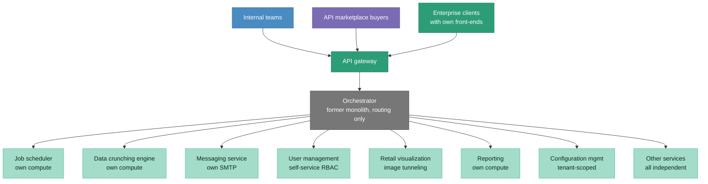
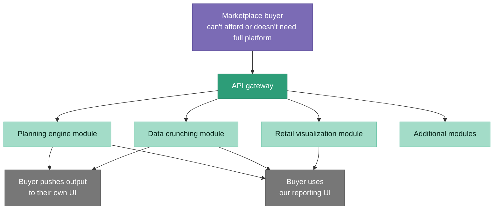
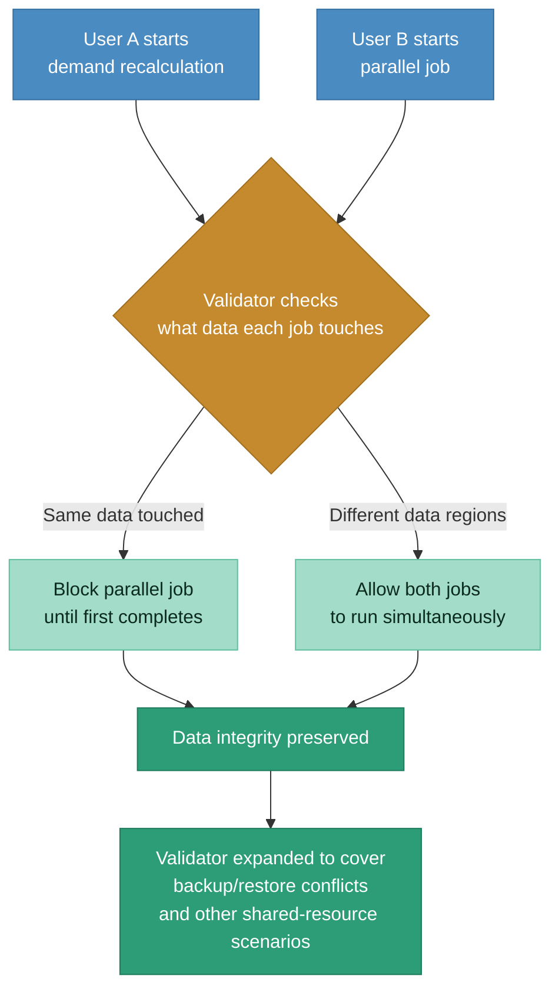
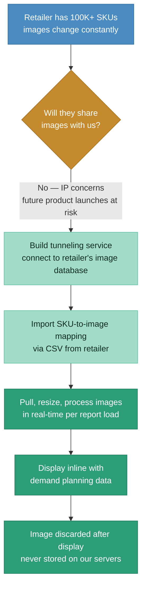

# After state: microservices + API marketplace

> Monolith reduced to orchestrator. ~20 services, ~50+ APIs, each independently scalable. Security layer per service. External marketplace access for modular purchase. Team grew from 3 to 18.

### API marketplace: modular purchase

### Validator service: progressive job conflict resolution

### Image processing service: solving the IP trust problem

## Before vs. after comparison

| Dimension | Before | After |
|-----------|--------|-------|
| **Architecture** | Single monolith, all services in one codebase | ~20 independent microservices, ~50+ APIs. Monolith is just an orchestrator. |
| **Compute** | Shared. One heavy job starves everything. | Independent per service. Job scheduler scaling doesn't affect messaging. |
| **Failure isolation** | 2-3 days to find the responsible team | Each service independently monitored. Failures scoped to one service. |
| **External access** | Full platform or nothing | API marketplace: buy individual modules (data crunching, retail viz, planning engine) |
| **Concurrent jobs** | Two parallel jobs = data corruption and crashes | Validator service checks for conflicts. Progressive relaxation based on what data each job touches. |
| **User management** | Every access change = ticket to implementation team | Self-service RBAC. User Manager role with tenant-scoped access. |
| **Image processing** | Not possible (retailers wouldn't share images) | Tunneling service pulls, processes, displays, and discards. Never stores. |
| **Team** | 3 people (PM + architect + junior dev) | 18 people (3 PMs, 15 devs) |
| **Market access** | Enterprise-only, full platform deals | SMBs and modular buyers via marketplace. New market segment unlocked. |
| **Customer growth** | Constrained by reliability and packaging limitations | 700% growth in number of customers supported |

## Key architectural decisions

**Why the monolith became an orchestrator, not deleted:**
Rewriting from scratch would have taken 2+ years with massive risk. Keeping the monolith as a thin routing layer meant we could decompose incrementally, one service at a time, with rollback capability at each step. By the end, the monolith did nothing but route requests to the right microservice.

**Why the validator started restrictive and relaxed over time:**
The initial version blocked all concurrent jobs within a tenant. This introduced delays but stabilized the system immediately. Then we progressively relaxed the rules based on data analysis: if Job A only touches demand data in APAC and Job B only touches supply data in Europe, let them run simultaneously. Starting permissive and adding restrictions after failures would have been a worse user experience than starting strict and relaxing as we gained confidence.

**Why the image service tunnels instead of stores:**
Retailers refused to upload product images to our servers. The IP risk (future product launches, packaging changes) was too high for their legal teams. Tunneling directly to the retailer's image database, processing on the fly, and never storing anything was the only design that passed their security review. Higher compute cost per request, but it unlocked the entire retail module.
