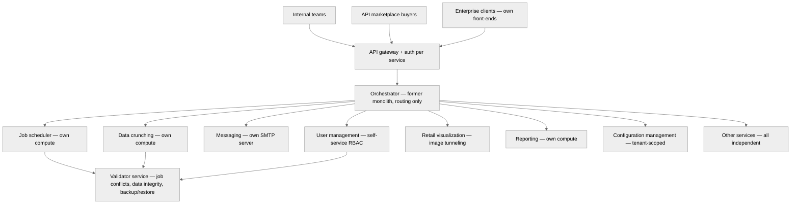

# After state: microservices + API marketplace

> Monolith reduced to orchestrator. ~20 services, ~50+ APIs, each independently scalable. External marketplace access for modular purchase.

### What changed

| Dimension | Before | After |
|-----------|--------|-------|
| **Architecture** | Single monolith, all services in one codebase | ~20 independent microservices, ~50+ APIs |
| **Compute** | Shared. One heavy job starves everything. | Independent per service. No blast radius. |
| **Failure isolation** | 2-3 days to find the responsible team | Each service independently monitored and scoped |
| **External access** | Full platform or nothing | API marketplace: buy individual modules |
| **Concurrent jobs** | Parallel jobs = data corruption + crashes | Validator checks for conflicts, allows safe parallelism |
| **User management** | Every change = ticket to implementation team | Self-service RBAC with tenant-scoped permissions |
| **Team** | 3 people | 18 people (3 PMs, 14 devs and I) |
| **Customer growth** | Constrained by reliability | 700% growth supported |

### Key architectural decisions

**Why the monolith became an orchestrator, not deleted:**
Rewriting from scratch would have taken 2+ years with massive risk. Keeping the monolith as a thin routing layer meant we could decompose incrementally, one service at a time, with rollback capability at each step.

**Why auth per service, not a central auth gateway:**
Central auth creates a single point of failure and doesn't support the marketplace model. Different marketplace clients need access to different service combinations. Per-service auth enables granular access control.

**Why the validator is a cross-cutting service, not embedded per microservice:**
Job conflict detection requires a global view of what's running across the tenant. Embedding validation in each service would mean each one makes concurrency decisions without knowing what other services are doing. A dedicated validator has the full picture.
