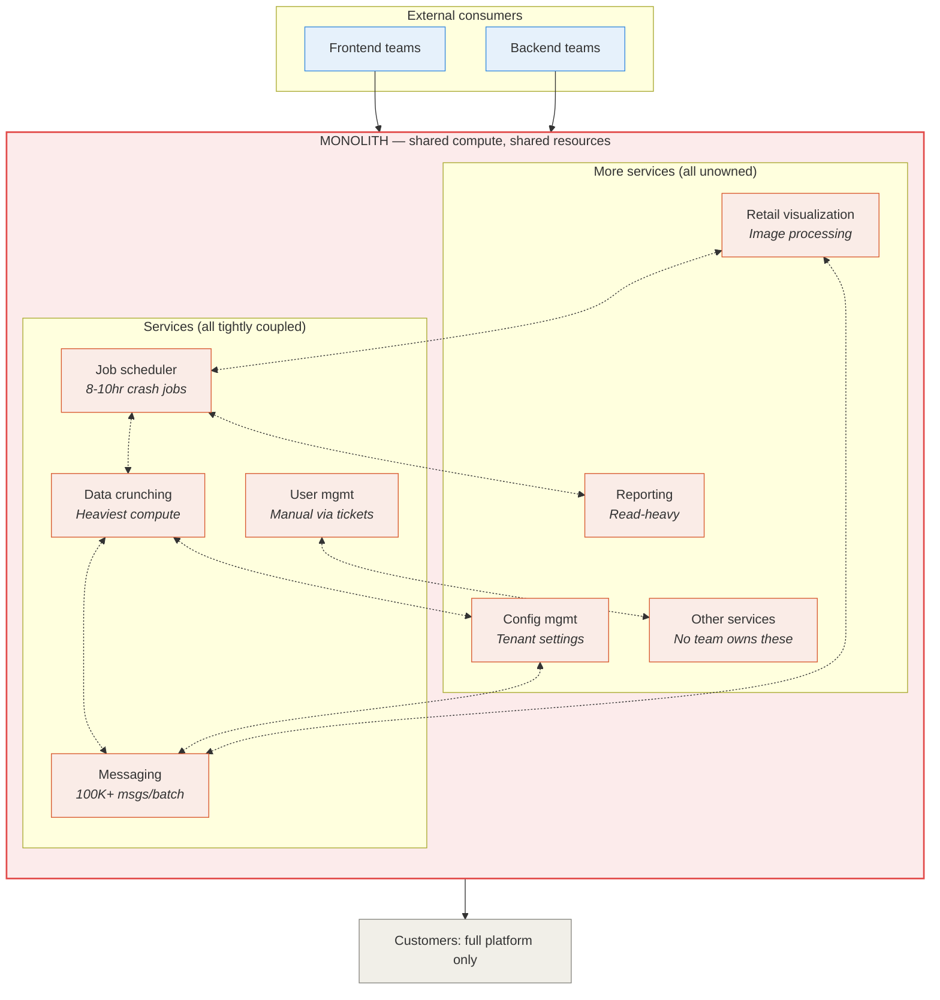

# Before state: monolithic architecture

> All 21+ services in one codebase, shared compute, no ownership of the communication layer.

## Pain points

| Problem | Impact |
|---------|--------|
| **No ownership of inter-service communication** | 2-3 days just to identify which team should investigate a failure |
| **Shared compute resources** | One customer's 8-10 hour demand recalculation job starves all parallel workloads. Platform crashes in multi-tenant environments. |
| **No modular access** | Enterprise prospects wanted specific modules (data crunching, planning engine) with their own front-end. Architecture made this impossible. Full platform or nothing. |
| **Scaling = scaling everything** | Can't scale messaging independently of reporting. A spike in SMTP load (100K+ notifications) pulls compute from unrelated services. |
| **SLA penalties accumulating** | Weekly downtimes in multi-tenant environments. Customers escalating. Strategic accounts threatening to leave. |
