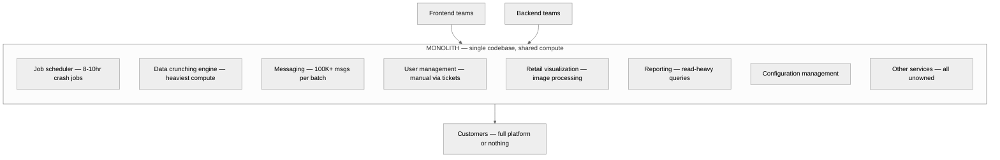
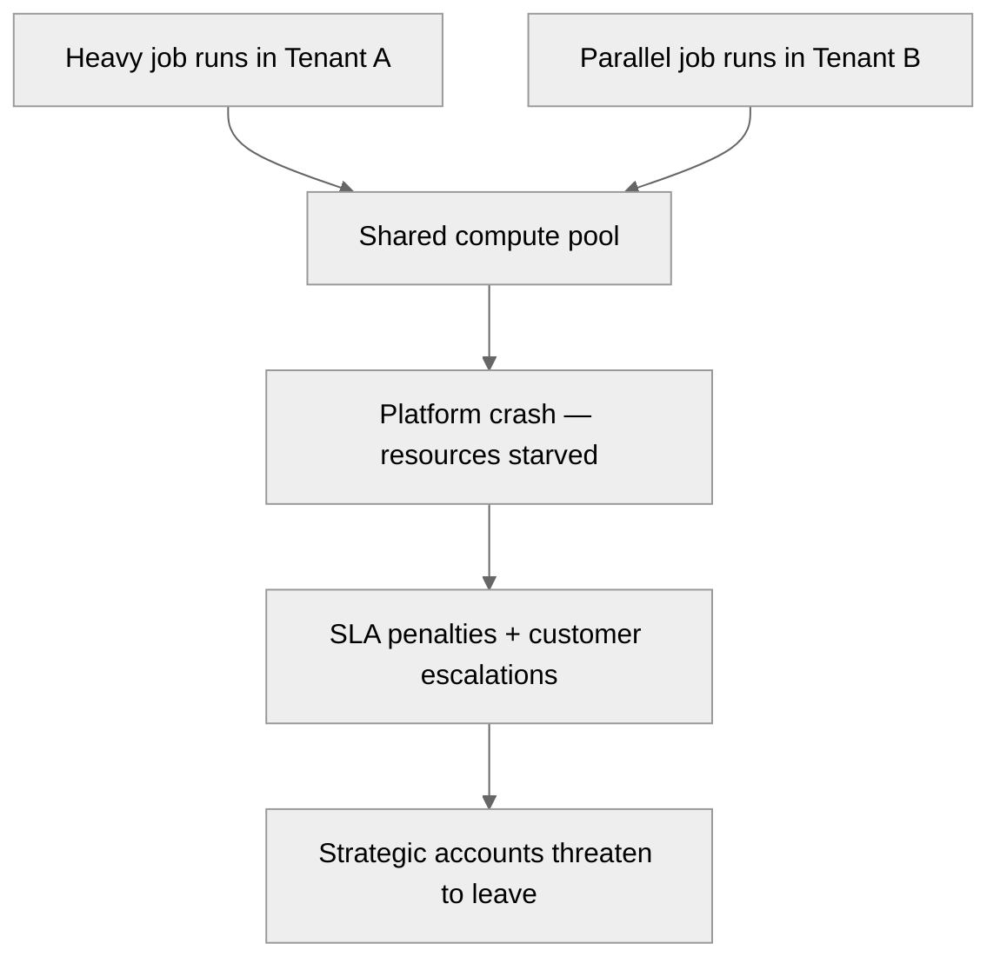

# Before state: monolithic architecture

> All 21+ services in one codebase, shared compute, no ownership of the communication layer.

### What this architecture caused

### Pain points

| Problem | Impact |
|---------|--------|
| **No ownership of inter-service communication** | 2-3 days just to find which team should investigate a failure |
| **Shared compute** | One customer's 8-10 hour demand recalculation job starves all parallel workloads |
| **No modular access** | Enterprise prospects wanted specific modules with their own front-end. Architecture made it impossible. |
| **Can't scale independently** | A spike in SMTP load (100K+ notifications) pulls compute from every unrelated service |
| **SLA penalties** | Weekly downtimes in multi-tenant environments. Strategic accounts threatening to leave. |
