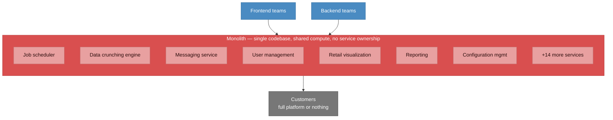
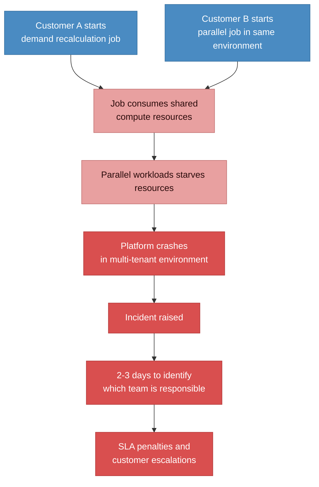
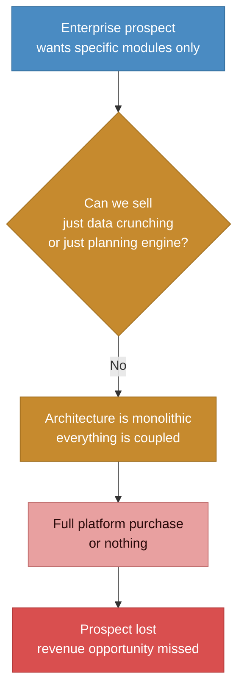

# Before state: monolithic architecture with no ownership

> All 21+ services in one codebase, shared compute, no ownership of the communication layer. 2-3 days to identify which team should fix a failure. Enterprise prospects walking away because we couldn't sell modules.

### How concurrent jobs crashed the platform

### Why enterprise prospects walked away

## Pain points summary

| Problem | Impact |
|---------|--------|
| **No ownership of inter-service communication** | 21+ services talking to each other with no team owning the connections. 2-3 days just to identify which team should investigate a failure. |
| **Shared compute resources** | One customer's 8-10 hour demand recalculation job starves all parallel workloads. Platform crashes in multi-tenant environments. |
| **No modular access** | Enterprise prospects wanted specific modules (data crunching, planning engine) with their own front-end. Architecture made this impossible. Full platform or nothing. |
| **Scaling = scaling everything** | Can't scale messaging independently of reporting. A spike in SMTP load (100K+ notifications) pulls compute from unrelated services. |
| **SLA penalties accumulating** | Weekly downtimes in multi-tenant environments. Strategic accounts threatening to leave. Penalties mounting while teams debate ownership. |
| **No external API access** | Platform was internal-only. No way to expose individual services to external customers or marketplaces. |
